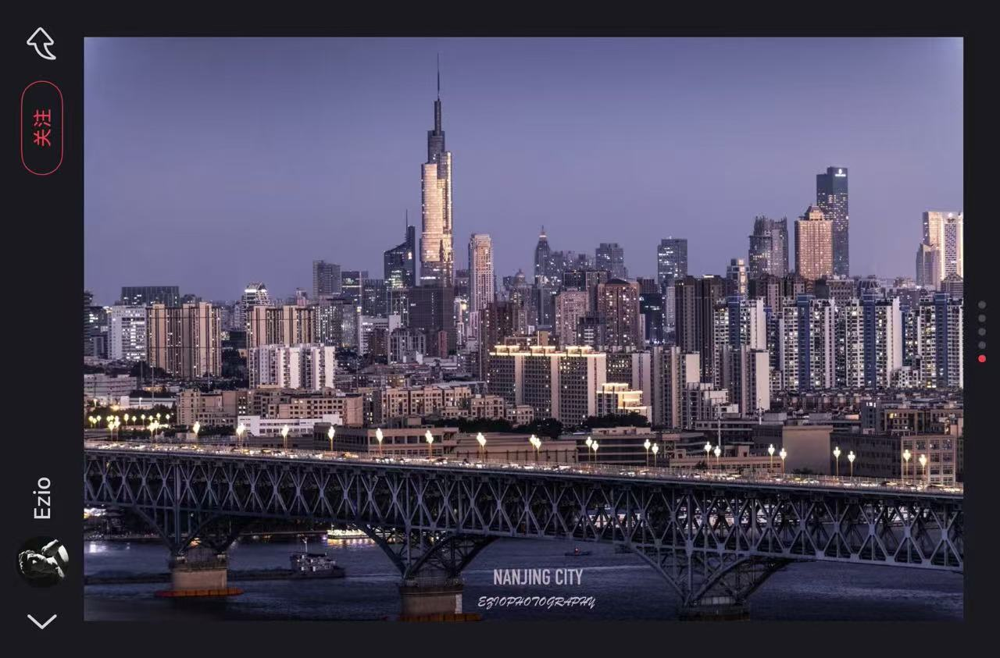

# 生活在南京

今天刚从杭州回来，到南京南后开车回自己家。去杭州那天欧阳问我要不要尝试写写四年来在南京生活的感受，很感谢欧阳老师给我这次机会。最近和朋友讨论了很多科幻作品，又因为这次在杭州其实是在做一个和科幻作品相关的实习，讨论的核心话题刚好就包括科幻小说《我们生活在南京》。所以当欧阳老师讲这件事的时候，我第一反应就想到了这部作品。这部作品里面确实有很多南京的痕迹，刚好我也想写写四年来我在南京的一些感受和想法，总而言之，谨以此文来纪念我在南京的这四年。

现在我正在经过长江大桥，今天是3月13号，春天黑得比较晚，所以六点多经过长阳大桥时，能看到一片漂亮的夕阳。我觉得六点多这个时间点格外美好，既不像早上早起那样让人觉得疲惫，也不会因为太晚让人感觉一整天都要结束。下午五六点多，感觉刚刚好是所谓“生活”的开始——白天结束了学习和工作，六点多之后开始拥有自己的时间，我觉得南京就是这样一个很适合去“生活”的地方。

不知道你有没有看过一部韩剧叫《眼泪女王》，我很喜欢这部剧。这部剧里有一个场景，金秀贤演的男主角在德国的街头上，穿过当地的大桥跑到市场，给女主角买代表幸运的四叶草。这个片段真的很打动我，一方面是因为奔跑这件事本身，就是一件很有生命力的事。比方说第56届韩国电影大钟奖的获奖作品之一，金高银和丁海寅主演的《柳烈的音乐专辑》里面有一个镜头：金高银听电台时，突然听到了男主角的声音，那时他们已经很多年没见了，她立刻背着包、挎着帆布袋飞快奔跑，穿过一座桥来到男主角所在的电台外面，朝他挥手。我始终觉得这个场景很有感染力，奔跑本身特别充满生命力。金秀贤在德国奔跑的场景，时间也接近傍晚，他在德国的街头、大桥上奔跑，剧情里拉了远景，拍了大桥的全貌和当时的天色。蓝调时刻，加上奔跑带来的生命力，特别美好。

南京此刻就有这样的氛围，车窗外是开阔的长江，还有城市的傍晚景致，真的美极了。所以我想这是一个适合朝九晚五生活的城市，最适配南京的生活方式，就是早上九点出门工作，下午五六点通勤回家，刚好能在通勤路上欣赏外面的景色。南京并不是一个适合去拼命实习、拼命工作的城市，这里其实更适合去感受，去感受自己和这座城市的联结。身边有朋友吐槽在南京找不到合适的实习，我自己之前也在南京找过实习，结果也不尽如人意，但是即便在这里可能得不到什么实际的东西，也会对这座城市生出无限的怀念。南京真正的特质是包容，它不像上海、杭州那么时髦、新潮。大学作为很多人出发的第一步，当来到一座陌生的新城市时，或许总会有那种格格不入的被排斥感，但如果你来到的是南京，那他不会，他会很包容地接纳一切。我是扬州人，虽然也不算很偏远，但大学之前的生活一直是两点一线，上学、回家，所以有时候会觉得自己算是个小镇做题家吧，刚离开自己家去到大城市时，还是会有不属于这里的疏离感。但南京不一样，南京不会让你觉得自己格格不入，它会包容地接受你的一切。南京是大学择校的绝佳选择，无论你从哪里来：若是从大城市来，南京虽算不上顶尖的一线城市，但也绝不落后，能在这里感受到和家乡相似的熟悉感；若是从小地方来，南京也会毫无保留地接纳你。南京高校众多，在这座城市里，能遇到很多好朋友，而且各类高校的专业五花八门，能结交到各行各业的人。可能某天出去玩，偶然认识一个艺术学院的同学，对方会带你见识到完全不一样的世界；哪怕是本身生活略显单调的理工生，也能在南京认识很多不同领域的人。南京是一座很有人文情怀的城市，很多文科同学都很向往这里，即便在南京学理科，也能感受到浓浓的人文氛围，这份氛围会将你紧紧包裹。有的城市你身处其中，会觉得自己仿佛只是为了打工、为了开拓而生，你能知道自己在为社会、为世界的未来做贡献，却感受不到城市为你自己带来的精神滋养。但是在南京的这四年里，我经历了很多事，也发生了很多变化。初高中六年，我几乎把自己榨干了，一直拼命学习，所以刚到南京的第一年，整个人格外疲惫，作息也很不规律，有时白天睡一整天，晚上出去吃顿饭，回来又继续玩，过着很不健康的生活，但南京这座城市，包容地接受了我的一切。我最想给所有人的建议是，倘若如果你真的来到了南京，暂时先别为了工作、未来而焦虑吧，先享受在南京的当下就好。南京或许是很多人的过客，这座城市来过很多人，也送走了很多人。有人抱着向往来到南京，又为了生计离开南京，不管你的选择是什么，南京就像一位母亲，永远会在这里等着你回来。

 

大一在鼓楼校区时，我有一个很喜欢的放松方式，那时候我会在晚上八九点钟出门骑车。七八点钟吃完饭，就骑着车在南京的大街小巷游荡，能真切感受到这座城市的烟火气，那一刻，我不再只是一名大学生，而是真正和这座城市联结在一起的南京人。大学校园固然美好，但如果一直待在校园、待在宿舍里，很难和社会产生真正的联结。而在鼓楼的街头游荡，即便只是走在大街小巷，没有真正走进居民区，也能感觉自己和这座城市的历史联结在了一起：走到大纱帽巷街，会想到这里以前或许是卖帽子的；走到羊皮巷，会想到这里昔日或许是羊皮交易的场所，那种穿越时空的共鸣感，格外强烈。

我想，科幻作品《我们生活在南京》会有穿越时空的设定，或许正是因为南京本就是一座适合感受时空、感受历史、感受空间的城市。城市里的很多物件，都是连接过去、现在与未来的纽带，有句话说“建筑是凝固的音乐”，我觉得建筑同样是历史的凝结。在南京，能看到很多这样的历史产物，让你觉得自己和这座城市的历史、未来紧紧相连：看到新的大楼拔地而起，会知道这座建筑会一直矗立在这里，被未来来到南京的人看见；看到老旧的建筑，会知道曾经的人，也和我一样望着这座建筑，这一刻会真切感受到，不同时刻的人，其实都是彼此联结的——曾经的人，或许也走过我现在走的路；未来的人，或许也会来到我此刻所在的地方；如果我在这里留下一句话，未来也会有人看见这句话。

有一次在学校的逸夫楼看到过一面墙，墙上写满了各种各样的留言，我至今不知道这些留言是怎么来的，因为那只是一面很普通的墙，旁边是供自习、吃饭的矮桌子，还有给同学休息的沙发床。但就是这面墙，留有从十几年前到最新日期的各类留言，虽然随意在墙上留言的习惯算不上有素质，但这份跨越时光的痕迹，真的很有意思。有一次去香港办事，走在街头，看到很多涂鸦、街头绘画，还有很多人的留言，我觉得这种艺术形式格外有意义，这些留存下来的痕迹，本身就是一种时空的联结。

我们学校有一个很著名的专业——图书情报管理学，这让我时常思考：为什么我们要留存书本，为什么要管理历史资料，为什么要坚持考古？其实都是为了探寻时空之间的联结，让我们知道，自己从来都不是孤独的一个人。在南京，有时难免会觉得孤独，刚来到这座城市，找不到朋友，感受不到联结，但走在南京的街头，会想到，很多年前，或许也有人和我有着一样的感受。

燕子矶旁边有一块碑，叫“想一想死不得”碑，我一直很想去看看，却始终未能如愿，每次去要么是燕子矶公园关门了，要么是有其他状况，总之一直没成功去到，但我一直把这块碑收藏在地图里。人总会有心情不好的时候，去湖边吹吹风，会觉得自己很孤独，觉得自己一事无成，是个失败者，可如果这时看到这块“想一想死不得”碑，就会想到，很多年前，也有一个满怀郁闷的人来到这里，和我有一样的心情，那一刻就会觉得，自己并不是孤独的，总有一个人，跨越时空陪着你。就像科幻作品里提到的时空切片，你可以想象，在你所处的这个时空切片里，有一个人在另一个切片与你重叠，所以即便此刻在这个空间里你是一个人，但把时间叠加起来，在时空的重叠里，你的身边始终有另一个人，永远不会孤单。

再说说南京的游玩之处，大学四年，我在南京玩了不少地方，很喜欢中山植物园，最初是上一门课程时，老师带我们去实践才去到那里，中山植物园内满眼绿意，全是各类植物，景色真的绝美。还有玄武湖，其实玄武湖晚上按理说是关门的，但有很多偷偷闯进去的方法，我曾和两个朋友晚上偷偷闯进玄武湖，这件事也为我和南京这座城市，留下了很多独特的记忆和联结，心情不好的时候，晚上去到玄武湖走走，会有别样的感受，这份感受暂时难以用言语形容。

从我自身出发之外，还问了问许多同学的看法，下面这段来自我在乡村振兴与城市规划公选课上认识的浪漫HYQ：

我觉得南京给我印象很深刻的是城建和青春自由的氛围。南京的老城区城市规划可能有点混乱，但是整体是一个非常有秩序的地方；公共设施都很人性化and园林绿化做的很好，园圃更换都有自己的时令，走在南京的路上会很轻快。然后就是大学，南京有很多所大学，我自己也去参观过几个，带来的感觉就是自由与不设限。很适合演浪漫偶像剧的一个地方！

还有曾经和我一起在鼓楼探索美食的小马：

我觉得南京是人文历史气息很重的一座城市！然后呢，我没有来过南京的朋友和来南京之前的我好像对南京有点误解（？），总觉得南京既然也在江苏一带那一定也有江南水乡的感觉，来了之后好像很少能在这里感受到烟雨江南的，那种有点「不食人间烟火」的感觉是很淡的。相反，这也是一座充满烟火气的城市吧。在鼓楼上学的时候特别有体会，紫峰大厦这样的新建筑不远处，又能看到老旧一点的居民楼、菜市场，也是热热闹闹的。所以说呢，南京不是只有一种城市风格，而为生活方式提供了很多的选择。无论是哪种生活节奏的人，都能在南京被很好地接住。

除此以外的大家好像都觉得，南京是一个十分充满生活气息的地方，市中心的颐和路、升州路，又或是仙林湖、羊山公园，都很适合你一个人去走走、散散心。这样城市由内而玩散发出的安宁气息，或许是你在别的城市体验不到的。

接下来说说南京的吃的，其实我对南京的吃的不算特别了解，在吃的方面，我算是一个很普通的人，不挑嘴，什么都吃，所以觉得什么都好吃。我本身比较喜欢吃碳水，格外爱吃包子、面条这类食物，因此在南京也算是很满足，这座城市算不上美食荒漠，好吃的东西有很多，随便走进路边的小店都能收获美味。不过我身边有很多对美食颇有研究的好朋友，以下是来自LMY的倾情介绍：

南京的美食无固定形式，不同于外地人对盐水鸭或鸭血粉丝汤的第一印象，真正生活在这里，你会感受到这座城市海纳百川的美食氛围。如果想吃韩餐，仙林随处可见韩国人经营的地道餐馆，如味多来、名家韩式料理，炸酱面和酱螃蟹是在别处吃不到的美味；如果想吃台湾菜，南京有很多台湾人开的店，比如黄大隆台北热炒，三杯鸡和蚵仔煎都很地道；如果想吃湘菜，稻满湘湘菜馆不容错过，平价美味。关于热门打卡美食，南京总是与时俱进，及时引进外地爆火的餐厅，如 Butterful & Creamorous 黄油与面包、Popeyes炸鸡等，弥补大家不能亲身前往的遗憾。所以生活在南京，五湖四海各种口味的人都能找到自己中意的美食，如果你让我旅游推荐吃啥，我还真说不出来什么，但是你说生活在南京吃的咋样，那我肯定会说：请放心，我吃的很好👌。

说完仙林，还有来自WXL的市中心攻略：

还得吃的话我必须推荐一下啾包的海盐卷啊无敌好吃，还有我觉得南京更适合错峰出行吃饭，要找那种全天营业的饭店。喝的话都是连锁店没什么好说的，也就是多了几家茶颜悦色，南京本土的那个熊猫一间店也不错，奶味很正。玩的话除了市中心可以狠狠逛街买衣服，也就是一些 citywalk 的街道，我觉得南京也很适合i咖啡人生活，好喝的咖啡很多。南京在我心目中就是交通还算便利，好吃的好玩的可以慢慢探索，老少咸宜的宜居城市。

生活在南京，无非就是吃喝住行，现在就不得不说说“行”这件事。在南京出行，有时会觉得很郁闷，那些莫名其妙的电动车，还有部分南京司机，因各种原因稍显混乱的地铁路线，以及过山车一样让人眩晕的公交车，真的让人无奈。大一的时候，有一次骑自行车从人行道过马路，当时绿灯还剩一两秒，我骑着车准备过去，结果有一辆车飞速驶来差点撞到我，紧急刹车后，还生气地骂我闯红灯，这件事让我觉得特别无语，就连这次开车回来的路上，也有一辆南京牌照的车，做出了让我郁闷的举动！就这样在南京待久了，脾气也会慢慢上来。但在南京待了这四年，我觉得自己最大的收获，就是不再那么胆小怯弱，脾气也变直了，现在在路上遇到不顺心的事，会当场反击。比如有人莫名骂我，我会直接回怼：“你自己才是违规的那个，喊什么喊，吵什么，素质真低。”朋友最近也对我的变化感到惊讶，有一次坐飞机排队登机，有个大爷离我特别近，我直接回头跟他说：“你们能不能不要离我那么近，我觉得不舒服，你们挤到我了。”朋友在旁边目瞪口呆，问我怎么敢直接这么说。还有一次在高铁上，有小朋友吵闹，我也很没情商地跟小朋友说：“小朋友，你这样很没素质。”我觉得在南京待这么久，真的把我的脾气“训练”出来了，和南京人相处，就是要直接一点。

在语言方面，南京话大多人应该都能听得懂，南京人的普通话也还算标准，不像去了广东，有时会因为语言不通不知所措。而且南京大学真的是一所很好的大学，辅导员和老师们都是特别好的人，在天空院的日子一直觉得很幸运。因为高考完那段时间太累了，所以上大学以来，我的学习成绩一直很一般，但老师们始终在各个方面帮助我们，我也在南京遇到了很多很好的朋友，大家都是有理想、有梦想的人，来到南京，多多少少都对这座城市有着别样的情感和态度。

我还很喜欢南京的河西片区，其实也就去过一两次，但有一次心情不好，下午刚好没事，就直接坐地铁去了奥体，刚好那天奥体有演唱会，我在场外听到了演唱会的声音，还听到了我最爱的那首《红蔷薇白玫瑰》。当时刚出地铁往场馆走，就听到了这首歌，那一刻，真的觉得无比幸福。在南京，有很多这样能感受到幸福的瞬间，比如和朋友一起去吃一顿好吃的饭，比如偶然遇到的一场美好，南京的美好，就是由无数个这样的幸福瞬间堆砌起来的。当然，在这里也会有忧郁、有伤心，但最终回想起来，已然是幸福。

还有一点想说，南京真的是一座很淳朴、厚重的城市，南京大学也是一所淳朴、厚重的大学，不知道是城市奠定了大学的基调，还是大学奠定了城市的基调，但可以肯定的是，二者的基调高度契合。在南京大学，在校园里感受到的氛围，和在南京这座城市里感受到的氛围，是完全一致的，不会觉得离开校园，踏入社会，就会有陌生感和恐惧感。可能因为我没有在扬州上过大学，所以在家的时候会觉得学校的世界和外面的世界是完全不一样的。在南京，街头随处可见穿着校服的高中生、初中生，学生也是这座城市的一部分，中午的时候，能看到很多学生在外面活动，这是一件很有意思的事，而在扬州，这样的画面会少很多。我在南京做了很久的家教，本身是江苏人，所以和家长、孩子沟通起来都很顺畅，也能感受到南京的小孩，虽然学业也很苦、很累，但依旧能感受到他们对生活的热爱，能感受到他们生活在这座城市里的真切感，他们没有那么压抑。

关于南京，还有很多感受想说，却又不知从何说起，只能讲讲我在南京四年生活里的一些片段，太多情绪和细节，是无法用言语表达的。希望此文也能激发你对南京的一些情感，无论是怀念，还是期待。（李梦涵，天体测量与天体力学方向，2022级本科生）

---
